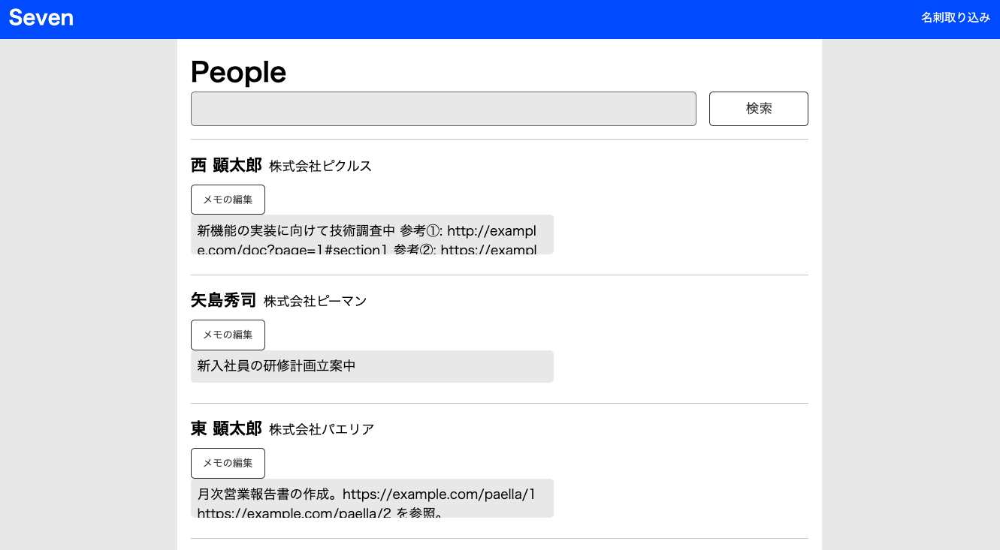

# Seven

26卒対象 Eight 1dayインターンのリポジトリです.

## 前提条件 📝

- Dockerとdocker composeがインストールされていること
- Gitがインストールされていること

[Dockerの公式サイト](https://docs.docker.com/get-docker/)からインストールしてください.

## 環境構築 🏗
まずはリポジトリをcloneします.

```console
$ git clone git@github.com:eightcard/eight-1day-internship-2024-summer.git
```

ディレクトリに移動して, imageのビルド・コンテナの立ち上げを行います.

```console
$ cd eight-1day-internship-2024-summer
$ docker compose up -d --build
```

全てのコンテナが立ち上がってることを確認しましょう.

```console
$ docker compose ps
NAME                            IMAGE                       COMMAND                  SERVICE   STATUS   PORTS
eight-1day-internship-app-1     eight-1day-internship-app   "bash -c 'rm -f tmp/…"   app       Up       0.0.0.0:3003->3003/tcp, :::3003->3003/tcp, 0.0.0.0:3036->3036/tcp, :::3036->3036/tcp
eight-1day-internship-db-1      mysql:8.0.30                "docker-entrypoint.s…"   db        Up       33060/tcp, 0.0.0.0:3303->3306/tcp, :::3303->3306/tcp
eight-1day-internship-minio-1   minio/minio:latest          "/usr/bin/docker-ent…"   minio     Up       9000/tcp, 0.0.0.0:9003->9001/tcp, :::9003->9001/tcp
```

アプリケーションが起動していることを確認しましょう.(初回は時間がかかります)

```console
$ docker compose logs app | grep started
app-1  | 02:47:09 vite.1 | started with pid 1943
app-1  | 02:47:09 web.1  | started with pid 1944
```

アプリケーションが起動したら、以下のコマンドで初期データを登録します.

```console
$ docker compose exec app rails db:seed
```

ここまでのコマンドを打ち終えたら [http://localhost:3003](http://localhost:3003) を開いてアプリケーションが起動できているか確認しましょう！\
以下のような画面が表示されれば環境構築は完了です。



開発で使いそうなコマンドは[COMMAND.md](COMMAND.md)にありますので参考にしてください.

## 環境構築のトラブルシューティング 🤔

### Q: `Bind for 0.0.0.0:3009 failed: port is already allocated` が出て起動できない

A: 使おうとしているport番号が他のコンテナが既に使っているのが原因です。\
環境変数で各コンテナのport番号を任意の値に変更できるようにしてあるので、`.env.sample`をコピーしてport番号を変更してみてください。

```console
$ cp .env.sample .env
```
```ruby
# .envの変更例
MYSQL_PORT=3309
APP_PORT=3009
VITE_PORT=3039
MINIO_CONSOLE_PORT=9009
```

### Q: データベースを初期状態に戻したい.

A: 以下のコマンドを実行してください. 作成・マイグレーション・仮データの作成を行います.
```console
$ docker compose exec app rails db:reset
```
